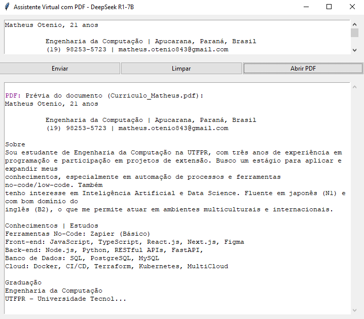

# Assistente Virtual

 <!-- Adicione uma imagem da interface se disponível -->

## Introdução

O Assistente Virtual é uma aplicação desktop com interface gráfica que combina capacidades de chat inteligente com processamento de documentos PDF. Desenvolvido em Python, oferece:

- Interação com modelos de linguagem via API Ollama local
- Extração e análise de texto de arquivos PDF
- Histórico de conversas persistente
- Sistema de cache para respostas frequentes
- Interface intuitiva com suporte a multitarefa assíncrona

## Estrutura do Projeto

| Arquivo            | Descrição                                                            |
| ------------------ | -------------------------------------------------------------------- |
| `assistente.py`    | Código principal com interface gráfica e lógica de funcionamento     |
| `chat_history.txt` | Armazena todo o histórico de conversas em formato texto              |
| `chat_cache.db`    | Banco de dados SQLite para cache de perguntas e respostas frequentes |
| `README.md`        | Documentação do projeto (este arquivo)                               |

## Instalação

1. **Pré-requisitos**:

   - Python 3.8+
   - [Ollama](https://ollama.ai/) instalado e rodando localmente
   - Modelo DeepSeek R1-7B instalado: `ollama pull deepseek-r1:7b`

2. Instalar dependências:

   ```bash
   pip install -r requirements.txt
   ```

   Dependências:

   - aiohttp >= 3.9.3
   - PyMuPDF >= 1.23.8

   Uso:
   Para iniciar o aplicativo, execute:
   $ python assistente.py

   Funcionalidades:

   - Chat: Digite sua mensagem e pressione Enter ou clique em "Enviar".
   - PDF: Extraia texto de documentos clicando em "Abrir PDF".
   - Limpar: Use o comando /limpar ou o botão dedicado para reiniciar a conversa.
   - Histórico: As conversas são mantidas automaticamente entre sessões.

   Atalhos:

   - Enter: Enviar mensagem
   - Shift + Enter: Nova linha na caixa de texto
   - Ctrl + O (Windows/Linux) ou Cmd + O (macOS): Abrir diálogo de arquivo PDF

   Requisitos:
   Sistema Operacional:

   - Windows 10+
   - macOS 12+
   - Distribuição Linux moderna

   Hardware Mínimo:

   - 8GB RAM
   - 4GB de espaço livre em disco
   - Conexão com a internet para API Ollama

   Dependências Python:

   - aiohttp: Comunicação assíncrona com a API Ollama
   - PyMuPDF: Processamento de PDFs
   - tkinter: Interface gráfica padrão do Python

**Nota:** Este README assume que o Ollama está configurado e rodando na porta padrão 11434. Para configurações personalizadas, ajuste a URL da API no arquivo `assistente.py`.
